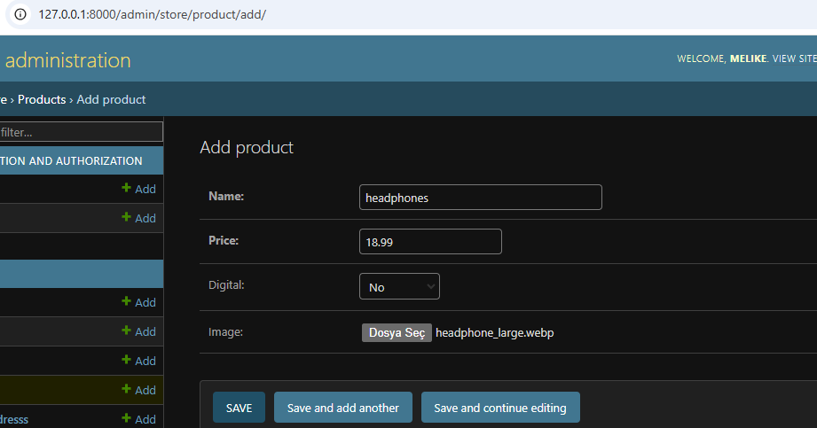

# Django E-Commerce Site: Database Models

This project involves creating the database models for a Django-based e-commerce application. The models include the built-in Django User model and four additional models: Customer, Product, Order, OrderItem, and ShippingAddress.

## Database Models

### 1. User
- Django's built-in user model is used.
- Automatically handles authentication and user management.

### 2. Customer
Represents a customer on the platform, linked to the User model.
```python
from django.db import models
from django.contrib.auth.models import User

class Customer(models.Model):
    user = models.OneToOneField(User, null=True, blank=True, on_delete=models.CASCADE)
    name = models.CharField(max_length=200, null=True)
    email = models.CharField(max_length=200)

    def __str__(self):
        return self.name
```

### 3. Product
Represents a product in the store.
```python
class Product(models.Model):
    name = models.CharField(max_length=200)
    price = models.FloatField()
    digital = models.BooleanField(default=False, null=True, blank=True)

    def __str__(self):
        return self.name
```

### 4. Order
Represents an order made by a customer.
```python
class Order(models.Model):
    customer = models.ForeignKey(Customer, on_delete=models.SET_NULL, null=True, blank=True)
    date_ordered = models.DateTimeField(auto_now_add=True)
    complete = models.BooleanField(default=False)
    transaction_id = models.CharField(max_length=100, null=True)

    def __str__(self):
        return str(self.id)
```

### 5. OrderItem
Represents a single item in an order.
```python
class OrderItem(models.Model):
    product = models.ForeignKey(Product, on_delete=models.SET_NULL, null=True)
    order = models.ForeignKey(Order, on_delete=models.SET_NULL, null=True)
    quantity = models.IntegerField(default=0, null=True, blank=True)
    date_added = models.DateTimeField(auto_now_add=True)
```

### 6. ShippingAddress
Holds the shipping address details for physical products.
```python
class ShippingAddress(models.Model):
    customer = models.ForeignKey(Customer, on_delete=models.SET_NULL, null=True)
    order = models.ForeignKey(Order, on_delete=models.SET_NULL, null=True)
    address = models.CharField(max_length=200, null=False)
    city = models.CharField(max_length=200, null=False)
    state = models.CharField(max_length=200, null=False)
    zipcode = models.CharField(max_length=200, null=False)
    date_added = models.DateTimeField(auto_now_add=True)

    def __str__(self):
        return self.address
```

## Steps to Set Up

1. **Import the User Model**
   ```python
   from django.contrib.auth.models import User
   ```

2. **Create the Models**
   Implement the above models in your `models.py` file.

3. **Run Migrations**
   Apply the changes to your database:
   ```bash
   python manage.py makemigrations
   python manage.py migrate
   ```

4. **Register Models in admin.py**
   Register the models for the Django admin interface:
   ```python
   from django.contrib import admin
   from .models import *

   admin.site.register(Customer)
   admin.site.register(Product)
   admin.site.register(Order)
   admin.site.register(OrderItem)
   admin.site.register(ShippingAddress)
   ```

## Summary
### Create User
Now we can create a user and login to make sure all our models were properly registered.


